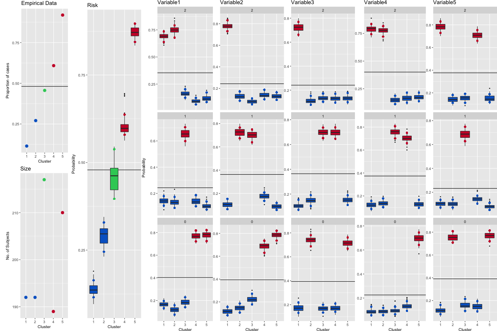
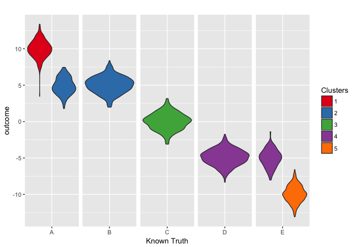
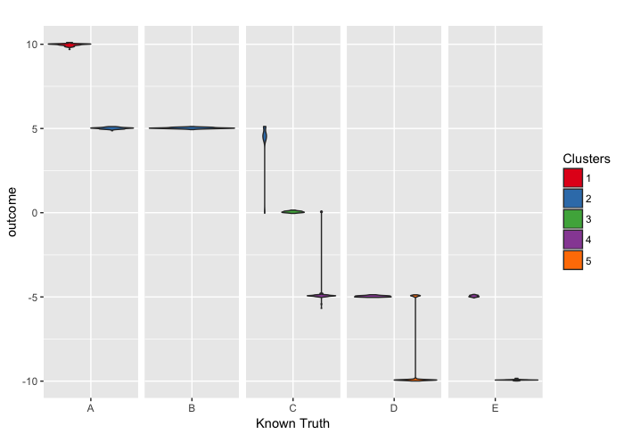
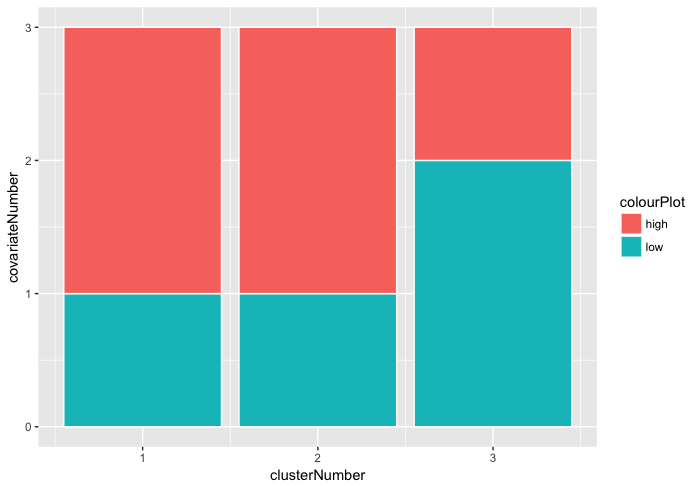
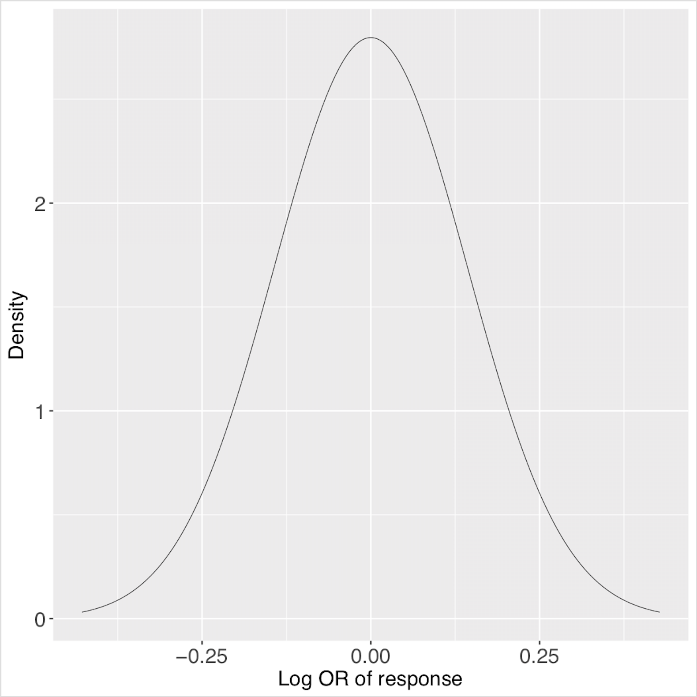
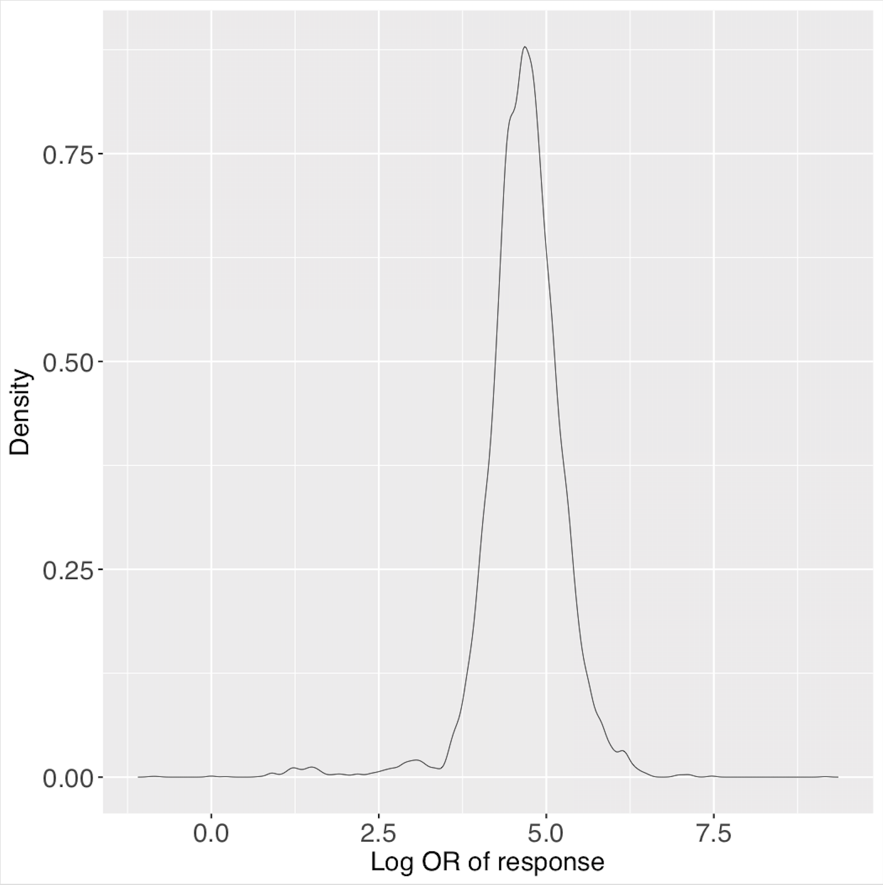

# PReMiuM manual

Author: Silvia Liverani

Updated: December 10th, 2019

### Contents

1. Introduction
2. Generating data
3. Running PReMiuM
4. Postprocessing
5. Plot
6. Plots for known-truth clusterings
7. Predictions
8. Replicating a run: setting the seeds
9. Unit testing
10. SessionInfo

## 1 Introduction

First of all, we load the R package PReMiuM and set a seed to ensure every run gives the same results
in this manual.

```r
library(PReMiuM)
set.seed(1234)
```

## 2 Generating data

PReMiuM includes a few functions to generate data. The data is generated by the function _generateSampleDataFile_. The input of the function is a list of parameters. In the example below we generated a Bernoulli (ie. binary) distributed outcome and discrete covariates. The exact parameters of the data
generating functions are obtained by writing the command in R. Some of the values returned in a list by this function are shown below: cluster sizes; the parameters for cluster 1 (value of θ as well as the probabilities for the categories of the 5 discrete covariates - they all 3 levels); the vector of fixed effect coefficients β and the probability with which missing values are to be inputted into the dataset.

```r
clusSummaryBernoulliDiscrete()$clusterSizes

# [1] 200 200 200 200 200

clusSummaryBernoulliDiscrete()$clusterData[[1]]

# $theta
# [1] 2.
#
# $covariateProbs
# $covariateProbs[[1]]
# [1] 0.8 0.1 0.
#
# $covariateProbs[[2]]
# [1] 0.8 0.1 0.
#
# $covariateProbs[[3]]
# [1] 0.8 0.1 0.
#
# $covariateProbs[[4]]
# [1] 0.8 0.1 0.
#
# $covariateProbs[[5]]
# [1] 0.8 0.1 0.

clusSummaryBernoulliDiscrete()$fixedEffectsCoeffs

# [1] 0.1 -0.

clusSummaryBernoulliDiscrete()$missingDataProb

# [1] 0
```

Other functions to generate data from other models (the names of the functions should be self explanatory).

```r
clusSummaryBernoulliDiscrete()
clusSummaryBernoulliNormal()
clusSummaryBernoulliDiscreteSmall()
clusSummaryBinomialNormal()
clusSummaryCategoricalDiscrete()
clusSummaryNormalDiscrete()
clusSummaryNormalNormal()
clusSummaryNormalNormalSpatial()
clusSummaryPoissonDiscrete()
clusSummaryPoissonNormal()
clusSummaryPoissonNormalSpatial()
clusSummaryVarSelectBernoulliDiscrete()
clusSummaryBernoulliMixed()
clusSummaryWeibullDiscrete()
clusSummaryQuantileNormal()
```
The data is then generated as follows. The dataset is stored in a list environment with the following
output obtained when running it.

```r
inputs <- generateSampleDataFile(clusSummaryBernoulliDiscrete())
head(inputs$inputData)

# outcome Variable1 Variable2 Variable3 Variable4 Variable5 FixedEffects
# 1 1 0 0 0 0 1 -0.
# 2 1 0 0 0 0 0 0.
# 3 1 0 0 0 0 0 2.
# 4 1 0 1 0 0 0 -0.
# 5 1 0 2 0 0 0 1.
# 6 1 0 0 0 0 0 -0.
# FixedEffects
# 1 -0.
# 2 -0.
# 3 -1.
# 4 0.
# 5 1.
# 6 1.

inputs$covNames

# [1] "Variable1" "Variable2" "Variable3" "Variable4" "Variable5"

inputs$xModel

# [1] "Discrete"

inputs$yModel

# [1] "Bernoulli"

inputs$nCovariates

# [1] 5

inputs$fixedEffectNames

# [1] "FixedEffects1" "FixedEffects2"

inputs$outcomeT

# NULL
```

## 3 Running PReMiuM

We can now run profile regression using the data simulated above. The command `profRegr()`, which runs profile regression, is effectively running an MCMC. For that reason, it is recommended that it runs over many thousands, or tens of thousands, or more iterations. However, for simplicity and speed we will only run the MCMC for very few iterations in this manual. The burn in period is determined by the option **nBurn** and the number of iterations following the burn-in period is determined by the option **nSweeps**.  The output of this function is very large, so it is all saved in external files which are created when the
command is run. For this reason it is important to know in which folder the command is to be run, to know where to find the output files. The files will all be namedxyz_content.txtwherexyzis the name of the profile regression run and can be set by providing option output (which in the example below is output) and content is the content of the file (explained in more detail in the following section).

```r
runInfoObj<-profRegr(yModel=inputs$yModel,
                        xModel=inputs$xModel, nSweeps=100, nClusInit=15,
                        nBurn=300, data=inputs$inputData, output="output",
                        covNames = inputs$covNames,
                        fixedEffectsNames = inputs$fixedEffectNames, seed=12345)

# Random number seed: 12345
# Sweep: 1
```

### 3.1 Outputs of _profRegr_

Several files are created when _profRegr_ is run. We discuss the most important files below.

**Data input**  Before running the MCMC, _profRegr_ reads the inputs file and creates a file with the information needed to run the MCMC. The first 10 lines of this file are printed below.

```r
readLines("output_input.txt",15)

# [1] "1000" "5"
# [3] "Variable1" "Variable2"
# [5] "Variable3" "Variable4"
# [7] "Variable5" "2"
# [9] "FixedEffects1" "FixedEffects2"
# [11] "3 3 3 3 3" "1 0 0 0 0 1 -0.611972 -0.4461709"
# [13] "1 0 0 0 0 0 0.1709603 -0.8266961" "1 0 0 0 0 0 2.325253 -1.120312"
# [15] "1 0 1 0 0 0 -0.03949958 0.05577411"
```

**Number of clusters**  This file is of length equal to nSweeps (the number of iterations of the MCMC after the burn in period). Each line corresponds to an iteration and it includes a signle number, which is the number of clusters in that iteration.

```r
nClustersSweep1<-read.table("output_nClusters.txt")[1,1]
nClustersSweep

# [1] 18
```

**Number of observations in each cluster**    Each line of this file corresponds to one iteration of the MCMC. Each line gives the size of the clusters. The last number is the total number of observations clustered (ie the sum of all preceeding numbers in the line). The first line of this file is shown below.

```r
as.numeric(strsplit(readLines("output_nMembers.txt",1)," ")[[1]])

# [1] 192 187 226 174 172 3 10 18 15 1 1 0 0 1 0
# [16] 0 0 0 1000
```
**Log** This file includes several details about the MCMC run, including the parameters used, the MCMC samplers used, their acceptance rate, etc. See below.

```r
readLines("output_log.txt")

# [1] "Date and time: 2017-11-07 09:3257"
# [2] ""
# [3] "Data file path: output_input.txt"
# [4] ""
# [5] "Output file path: output"
# [6] ""
# [7] "Predict file path: No predictions run."
# [8] ""
# [9] "Seed: 12345"
# [10] ""
# [11] "Number of sweeps: 100"
# [12] "Burn in sweeps: 300"
# [13] "Output filter: 1"
# [14] "Proposal Type: gibbsForVActive, Acceptance Rate: 1"
# [15] "Proposal Type: updateForPhiActive, Acceptance Rate: 1"
# [16] "Proposal Type: metropolisHastingsForThetaActive, Acceptance Rate: 0.430274"
# [17] "Proposal Type: metropolisHastingsForBeta, Acceptance Rate: 0.32125"
# [18] "Proposal Type: gibbsForU, Acceptance Rate: 1"
# [19] "Proposal Type: metropolisHastingsForAlpha, Acceptance Rate: 0.4425"
# [20] "Proposal Type: gibbsForVInActive, Acceptance Rate: 1"
# [21] "Proposal Type: gibbsForPhiInActive, Acceptance Rate: 1"
# [22] "Proposal Type: metropolisHastingsForLabels123, Acceptance Rate: 0.525"
# [23] "Proposal Type: gibbsForThetaInActive, Acceptance Rate: 1"
# [24] "Proposal Type: gibbsForZ, Acceptance Rate: 1"
# [25] "Number of subjects: 1000"
# [26] "Number of prediction subjects: 0"
# [27] "Prediction type: RaoBlackwell"
# [28] "Sampler type: SliceDependent"
# [29] "Number of initial clusters: 15"
# [30] "Covariates: "
# [31] "\tVariable1 (categorical)"
# [32] "\tVariable2 (categorical)"
# [33] "\tVariable3 (categorical)"
# [34] "\tVariable4 (categorical)"
# [35] "\tVariable5 (categorical)"
# [36] "FixedEffects: "
# [37] "\tFixedEffects1"
# [38] "\tFixedEffects2"
# [39] "Model for Y: Bernoulli"
# [40] "Extra Y variance: False"
# [41] "Include response: True"
# [42] "Update alpha: True"
# [43] "Compute allocation entropy: False"
# [44] "Model for X: Discrete"
# [45] "Variable selection: None"
# [46] ""
# [47] "Hyperparameters:"
# [48] "shapeAlpha: 2"
# [49] "rateAlpha: 1"
# [50] "aPhi[j]: 1 1 1 1 1 "
# [51] "muTheta: 0"
# [52] "sigmaTheta: 2.5"
# [53] "dofTheta: 7"
# [54] "muBeta: 0"
# [55] "sigmaBeta: 2.5"
# [56] "dofBeta: 7"
# [57] ""
# [58] "400 sweeps done in 2 seconds"
```

**Cluster-specific parameters** There are several cluster-specific parameters in the model. Parameters that are cluster-specific are those that have a different value for each cluster. As the number of clusters changes from one sweep to the next, the number of these parameters changes from one sweep to the next. Each line in this file corresponds to an iteration of the MCMC, but each line has a different number of elements. The file forθhas one parameter for each cluster. The file for φ has the

```r
as.numeric(strsplit(readLines("output_theta.txt",1)," ")[[1]])

# [1] -0.1425500 0.3987900 2.3716500 -1.8412900 -1.3355100 2.
# [7] -1.5619900 5.0787100 0.4097990 0.0370899 -0.8097570 -0.
# [13] 0.4196360 -3.8771400 -0.5953140 0.0991222 1.4133000 -0.

phiSweep1 <- as.numeric(strsplit(readLines("output_phi.txt",1)," ")[[1]])
head(phiSweep1)

# [1] 0.1429560 0.7818570 0.7922470 0.1696810 0.0287445 0.
```

In the case of the cluster-specific vectors of parameters, such as φ, the data is printed over the clusters, then over the levels and then the covariates. So, for example, first we have the values of φ for level 1 of variable 1 in cluster 1. Then we have the value of level 1 of variable 1 in cluster 2, and so on. When all the values for all the clusters for level 1 of variables 1 are printed, the value of level 2 for variable 1 is printed to file, from the first to the last cluster. In the example below, all the values of φ are printed for cluster 1. In particular, the first three values are the posterior probabilities of level 1, level 2 and level 3 for variable 1. As expected, these three numbers sum up to 1.

```r
phiSweep1[seq(1,length(phiSweep1),nClustersSweep1)]

# [1] 0.1429560 0.7797510 0.0772932 0.1509710 0.8085250 0.0405046 0.
# [8] 0.7075090 0.1453380 0.1815340 0.7298390 0.0886271 0.1908880 0.
# [15] 0.
```
**Global parameters**   These are the other parameters of the model. Each line of these files corresponds to an iteration of the MCMC. The parameter β is for the fixed effects. The number of elements in this file is fixed and it corresponds to the number of fixed effects included in the model. The parameterαis the MCMC sample from the posterior distribution of α, the parameter of the Dirichlet process, and it is present only ifαis random (this is the default in _profRegr_; it can alternatively be set equal to a specific value).

```r
as.numeric(strsplit(readLines("output_beta.txt",1)," ")[[1]])

# [1] 0.044623 -0.

as.numeric(strsplit(readLines("output_alpha.txt",1)," ")[[1]])

# [1] 1.
```

## 4 Postprocessing

The output of PReMiuM is very rich, so post-processing is necessary to learn about the clustering structure,for example. There are three main functions for postprocessing.

```r
dissimObj <- calcDissimilarityMatrix(runInfoObj)

# Stage 1:1 samples out of 100
# Stage 2:1 samples out of 100

clusObj <- calcOptimalClustering(dissimObj, maxNClusters = 7)

# Max no of possible clusters: 7
# Trying 2 clusters
# Trying 3 clusters
# Trying 4 clusters
# Trying 5 clusters
# Trying 6 clusters
# Trying 7 clusters

riskProfileObj <- calcAvgRiskAndProfile(clusObj)

# Processing sweep 1 of 100
```

Computation of dissimilarity matrix First of all a dissimilarity matrix is computed. This is a matrix which is 1−S, whereSis a similarity matrix. See Molitor et al. (2010) Molitor et al (2010) for more details.  Computation of optimal clustering This function computes the optimal clustering based on the dissimilarity matrix computed in the previous step. It computes the optimal clustering by applying partitioning around medoids (PAM) to the dissimilarity matrix. Partitioning around medoids is a method that requires the number of clusters to be preset, so this function makes multiple attempts to fitting PAM with different number of clusters. In the example here I have set the maximum number of clusters to 7.

Computation of risks and profilesThis function computes the risks and the profiles for all covariates and all clusters. In order to do so, it looks up which cluster each observation belongs to in the final clustering. Then to compute the risks, for each MCMC iteration it computes a θ value, which is the average of all the θ values of the clusters which included the observations in each final cluster.

## 5 Plot

The plot in Figure 1 can be produced by running the following command.

```r
clusterOrderObj<-plotRiskProfile(riskProfileObj,"summary.png")
```

The data for the boxplots of the outcome are available in **riskProfileObj$risk** while the data for the boxplots of the covariates are available in **riskProfileObj$profile**.



Figure 1: This is summary.png, the plot created by running `plotRiskProfile()`.

## 6 Plots for known-truth clusterings

The simulated data is generated for 5 clusters of 200 observations each. Let us explore some plots for the output for cases when the true clustering of the observations is known. Say that the known-truth partition is given by the following.

```r
known <- c(rep("A",600),rep("B",600), rep("C",300),rep("D",500),rep("E",1000))
```
The data is generated as follows.

```r
set.seed(12578)
inputs <- generateSampleDataFile(clusSummaryNormalDiscrete())
```
Then we run profile regression.

```r
runInfoObj<-profRegr(yModel=inputs$yModel,
                        xModel=inputs$xModel, nSweeps=100, nClusInit=15,
                        nBurn=300, data=inputs$inputData, output="output",
                        covNames = inputs$covNames,
                        fixedEffectsNames = inputs$fixedEffectNames, seed=12345)

# Random number seed: 12345
# Sweep: 1

dissimObj <- calcDissimilarityMatrix(runInfoObj)

# Stage 1:1 samples out of 100
# Stage 2:1 samples out of 100

clusObj <- calcOptimalClustering(dissimObj, maxNClusters = 7)

# Max no of possible clusters: 7
# Trying 2 clusters
# Trying 3 clusters
# Trying 4 clusters
# Trying 5 clusters
# Trying 6 clusters
# Trying 7 clusters

riskProfileObj <- calcAvgRiskAndProfile(clusObj)

# Processing sweep 1 of 100

clusterOrderObj <- plotRiskProfile(riskProfileObj, "summary2.png")
```
The optimal partition found by profile regression is given by the following command.

```r
optAlloc<-clusObj$clustering
```

We now want to produce a few plots to compare the known truth to the clustering obtained by profile regression.
The first plot is showing how the distribution of the outcome for each true cluster is spread over the clusters identified by profile regression.

```r
library(ggplot2)
tmp_boxplot <- data.frame(opt=as.factor(optAlloc), outcome=inputs$inputData$outcome, known=as.factor(known))
p <- ggplot(tmp_boxplot, aes(x=known, y=outcome, fill=opt)) +
        geom_violin()+
        labs(title="",x="Known Truth", y = "outcome") +
        facet_grid(~known,scales='free',space='free') +
        guides(fill=guide_legend(title="Clusters")) +
        theme(strip.text.x = element_blank(), strip.background = element_blank())
# Use brewer color palettes
p + scale_fill_brewer(palette="Set1")
```


We can also do this plot replacing the distribution of observed outcome with the posterior distribution of θ.

```r
# Construct the number of clusters file name
nClustersFileName<-file.path(runInfoObj$directoryPath, paste(runInfoObj$fileStem,'_nClusters.txt',sep=''))
nClustersFile <- file(nClustersFileName, open="r")
# Construct the allocation file name
zFileName <- file.path(runInfoObj$directoryPath, paste(runInfoObj$fileStem,'_z.txt', sep=''))
zFile <- file(zFileName, open="r")
# Construct the theta file name
thetaFileName <- file.path(runInfoObj$directoryPath, paste(runInfoObj$fileStem,'_theta.txt', sep=''))
thetaFile <- file(thetaFileName, open="r")
firstLine <- ifelse(runInfoObj$reportBurnIn, runInfoObj$nBurn/runInfoObj$nFilter+2,1)
lastLine <- (runInfoObj$nSweeps+ifelse(runInfoObj$reportBurnIn, runInfoObj$nBurn+1,0))/runInfoObj$nFilter
nSamples <- lastLine-firstLine+
thetaByObs <- matrix(NA, ncol=runInfoObj$nSubjects, nrow=runInfoObj$nSweeps)

for(sweep in firstLine:lastLine){
    if(sweep == firstLine){
        skipVal <- firstLine - 1
    }else{
        skipVal <- 0
    }

    currMaxNClusters <- scan(nClustersFile, what=integer(), skip=skipVal,n=1,quiet=T)

    # Get the current allocation data for this sweep
    currZ <- scan(zFile, what=integer(), skip=skipVal, n=runInfoObj$nSubjects+runInfoObj$nPredictSubjects,quiet=T)
    currZ <- 1 + currZ

    # Get the risk data corresponding to this sweep
    currThetaVector <- scan(thetaFile, what=double(), skip=skipVal, n=currMaxNClusters, quiet=T)
    currTheta <- matrix(currThetaVector,ncol=1,byrow=T)

    for (i in 1:runInfoObj$nSubjects){
        thetaByObs[sweep,i] <- currTheta[currZ[i]]
        }
    }

tmp_boxplot2 <- data.frame(opt=vector(), outcome=vector(), known=vector())
for (c in 1:max(optAlloc)){
    for (k in names(table(known))){
        tmp_index <- which(optAlloc == c & known == k)
        tmp_length <- length(tmp_index)
        if (tmp_length > 1){
            tmp_value<-apply(thetaByObs[,tmp_index],1,mean)
            tmp_boxplot3<-data.frame(opt=rep(c,runInfoObj$nSweeps), outcome=tmp_value, known=rep(k,runInfoObj$nSweeps))
            tmp_boxplot2<-rbind(tmp_boxplot2,tmp_boxplot3)
            }
        if (tmp_length == 1){
            tmp_boxplot3<-data.frame(opt=rep(c,runInfoObj$nSweeps), outcome=thetaByObs[,tmp_index], known=rep(k,runInfoObj$nSweeps))
            tmp_boxplot2<-rbind(tmp_boxplot2,tmp_boxplot3)
            }
        }
    }
tmp_boxplot2$opt <- as.factor(tmp_boxplot2$opt)
tmp_boxplot2$known <- as.factor(tmp_boxplot2$known)
p <- ggplot(tmp_boxplot2, aes(x=known, y=outcome, fill=opt)) +
    geom_violin() +
    labs(title="",x="Known Truth", y = "outcome") +
    facet_grid(~known,scales='free',space='free') +
    guides(fill=guide_legend(title="Clusters")) +
    theme(strip.text.x = element_blank(), strip.background = element_blank())
# Use brewer color palettes
p + scale_fill_brewer(palette="Set1")
# close all files
close(zFile)
close(nClustersFile)
close(thetaFile)
```


Then we want to do some composite colour bars.

```r
inputs <- generateSampleDataFile(clusSummaryNormalNormal())
runInfoObj<-profRegr(yModel=inputs$yModel,
                        xModel=inputs$xModel, nSweeps=100, nClusInit=15,
                        nBurn=300, data=inputs$inputData, output="output",
                        covNames = inputs$covNames,
                        seed=12345)

# Random number seed: 12345
# Sweep: 1

dissimObj <- calcDissimilarityMatrix(runInfoObj)

# Stage 1:1 samples out of 100
# Stage 2:1 samples out of 100

clusObj <- calcOptimalClustering(dissimObj,maxNClusters = 7)

# Max no of possible clusters: 7
# Trying 2 clusters
# Trying 3 clusters
# Trying 4 clusters
# Trying 5 clusters
# Trying 6 clusters
# Trying 7 clusters

riskProfileObj <- calcAvgRiskAndProfile(clusObj)

# Processing sweep 1 of 100

clusterOrderObj <- plotRiskProfile(riskProfileObj,"summary3.png")
```

Then we make a composite colour bar plot.

```r
profile <- riskProfileObj$profile
meanSortIndex <- clusterOrderObj
muArray <- data.frame(covariateNumber=vector(),clusterNumber=vector(), colourPlot=vector())
for(j in 1:runInfoObj$nCovariates){
    # Compute the means
    muMat <- profile[,meanSortIndex,j]
    muMeans <- apply(muMat,2,mean)
    muMean <- sum(muMeans*clusObj$clusterSizes)/sum(clusObj$clusterSizes)
    muLower <- apply(muMat,2,quantile,0.05)
    muUpper <- apply(muMat,2,quantile,0.95)
    # Get the plot colors
    muColor <- ifelse(muLower>rep(muMean, length(muLower)), "high", ifelse(muUpper<rep(muMean,length(muUpper)),"low","avg"))
    muArrayNew <- data.frame(covariateNumber=rep(j,clusObj$nClusters), clusterNumber=c(1:clusObj$nClusters), colourPlot=muColor)
    muArray <- rbind(muArray, muArrayNew)
    }

# THIS IS NOT WORKING YET!!
ggplot(muArray, aes(x=clusterNumber, y=covariateNumber, fill=colourPlot)) +
    geom_col(stat="identity", colour="white")

```


## 7 Predictions

Profile regression can be used to compute the posterior predictive distribution of the outcome for given
values of the covariates. For example, let us simulate the data as follows.

```r
inputs <- generateSampleDataFile(clusSummaryBernoulliDiscrete())
head(inputs$inputData)

# outcome Variable1 Variable2 Variable3 Variable4 Variable5 FixedEffects
# 1 1 0 0 0 2 1 0.
# 2 1 0 1 0 0 0 1.
# 3 1 2 1 0 0 0 -0.
# 4 1 0 0 1 0 0 -0.
# 5 1 0 0 0 0 2 0.
# 6 1 0 0 0 1 0 0.
# FixedEffects
# 1 0.
# 2 0.
# 3 -0.
# 4 0.
# 5 0.
# 6 -2.
```

We can then prepare a data frame which contains the covariate values which we are interested in computing a prediction of the outcome for. The data frame must have as many columns as the number of covariates in the original dataset, and it may contain **NA** for covariate values which are unknown. The number of rows of the dataset corresponds to the number of predictive profiles that we are interested in computing. The columns of the data frame must have names that match the covariates in the original dataset.

```r
preds<-data.frame(matrix(c(2, 2, 2, 2, 2, 0, 0, NA, 0, 0),ncol=5,byrow=TRUE))
colnames(preds)<-names(inputs$inputData)[2:(inputs$nCovariates+1)]
preds

# Variable1 Variable2 Variable3 Variable4 Variable
# 1 2 2 2 2 2
# 2 0 0 NA 0 0
```

Then we can include this dataset into the function _profRegr_ using the option _predict_ and run the MCMC and the postprocessing functions.

```r
runInfoObj<-profRegr(yModel=inputs$yModel, xModel=inputs$xModel,
                        nSweeps=10000, nBurn=10000, data=inputs$inputData, output="output",
                        covNames=inputs$covNames,predict=preds,
                        fixedEffectsNames = inputs$fixedEffectNames)
dissimObj <- calcDissimilarityMatrix(runInfoObj)
clusObj <- calcOptimalClustering(dissimObj)
riskProfileObj <- calcAvgRiskAndProfile(clusObj)
```

The function _calcPredictions_ extracts the sample from the posterior predictive distribution for the predictive profiles. Below, the first 10 samples from the MCMC are shown for the two predictive profiles selected for this example.

```r
predictions <- calcPredictions(riskProfileObj,fullSweepPredictions=TRUE,fullSweepLogOR=TRUE)
predictions$predictedYPerSweep[1:10,,1]
```
The following command plots the posterior predictive distribution for each of the predictive profiles in
the matrixpredictions$predictedYPerSweep. See Figure 2.

```r
plotPredictions(outfile="predictiveDensity.pdf",runInfoObj=runInfoObj, predictions=predictions,logOR=TRUE)
```



These are the posterior predictive distributions for the two predictive profiles, saved in ‘predictiveDensity.pdf’ using the function _plotPredictions_.

## 8 Replicating a run: setting the seeds

It is possible to set the seed to replicate a run exactly. However, note that the seed must be set separately for R and C++. The function _set.seed_ in R sets the seed for all following commands run in R but it is also necessary to set the seed for the MCMC which is written in C++. This can be done using the option _seed_ in the function _profRegr_.

```r
set.seed(1234)
inputs <- generateSampleDataFile(clusSummaryPoissonDiscrete())

runInfoObj <- profRegr(yModel=inputs$yModel,
                            xModel=inputs$xModel, nSweeps=10,
                            nClusInit=20,
                            nBurn=20, data=inputs$inputData,
                            output="output",
                            covNames = inputs$covNames,
                            outcomeT = inputs$outcomeT,
                            fixedEffectsNames = inputs$fixedEffectNames,
                            seed=12345)

# Random number seed: 12345
# Sweep: 1
```
## 9 Tests

### 9.1 Unit testing

There are a couple of unit tests available in the package for quick testing of the package. The tests can be run as part of the R CMD check which can be run from terminal in the directory where the package PReMiuM is stored. The command to use is: `R CMD check PReMiuM_3.1.8.tar.gz`.

### 9.2 Benchmarking

The function _simBenchmark_ checks the cluster allocation of profile regression against the generating clusters for a selection of the simulated dataset provided within the package. When benchmarking PReMiuM on high performance computers, this function will allow the user to run varying distributions through PReMiuM and receive the output in an organized manner for comparison between runs. It can be used for testing accuracy when trying to optimize functions inside the PReMiuM package, as well as the overall performance in time/memory of the functions.  

This function can be used to compute confusion matrices for simulated examples, as shown in the example below.

```r
tester<-simBenchmark("clusSummaryBernoulliDiscrete")
print(table(tester[,c(1,3)]))

#                 generatingCluster
#clusterAllocation Known 1 Known 2 Known 3 Known 4 Known 5
#                1     181      14       2       5       2
#                2       6     174      17       2       3
#                3      11       2       4     184       9
#                4       2       2       2       6     185
#                5       0       8     175       3       1
```

The example below computes the confusion matrix for one analysis of the selected simulated datasets. 

```r
# vector of all test datasets allowed by this benchmarking function
testDatasets<-c("clusSummaryBernoulliNormal",
  "clusSummaryBernoulliDiscreteSmall","clusSummaryCategoricalDiscrete",
  "clusSummaryNormalDiscrete","clusSummaryNormalNormal", 
  "clusSummaryNormalNormalSpatial","clusSummaryVarSelectBernoulliDiscrete", 
  "clusSummaryBernoulliMixed")

# runs profile regression on all datasets and 
# computes confusion matrix for each one
for (i in 1:length(testDatasets)){
  tester<-simBenchmark(testDatasets[i])
  print(table(tester[,c(1,3)]))
}
```


## 10 SessionInfo

This file was compiled using a computer with the following packages:

```r
sessionInfo()

# R version 3.4.2 (2017-09-28)
# Platform: x86_64-pc-linux-gnu (64-bit)
# Running under: Ubuntu 16.04.3 LTS
#
# Matrix products: default
# BLAS: /usr/lib/libblas/libblas.so.3.6.
# LAPACK: /usr/lib/lapack/liblapack.so.3.6.
#
# locale:
# [1] LC_CTYPE=en_GB.UTF-8 LC_NUMERIC=C
# [3] LC_TIME=en_GB.UTF-8 LC_COLLATE=en_GB.UTF-
# [5] LC_MONETARY=en_GB.UTF-8 LC_MESSAGES=en_GB.UTF-
# [7] LC_PAPER=en_GB.UTF-8 LC_NAME=C
# [9] LC_ADDRESS=C LC_TELEPHONE=C
# [11] LC_MEASUREMENT=en_GB.UTF-8 LC_IDENTIFICATION=C
#
# attached base packages:
# [1] stats graphics grDevices utils datasets methods base
#
# other attached packages:
# [1] ggplot2_2.2.1 PReMiuM_3.1.
#
# loaded via a namespace (and not attached):
# [1] Rcpp_0.12.13 digest_0.6.12 ald_1.1 MASS_7.3-
# [5] grid_3.4.2 plyr_1.8.4 gtable_0.2.0 magrittr_1.
# [9] scales_0.5.0 stringi_1.1.5 rlang_0.1.2 reshape2_1.4.
# [13] lazyeval_0.2.0 labeling_0.3 RColorBrewer_1.1-2 tools_3.4.
# [17] stringr_1.2.0 munsell_0.4.3 plotrix_3.6-6 compiler_3.4.
# [21] colorspace_1.3-2 gamlss.dist_5.0-2 cluster_2.0.6 tibble_1.3.
```

## References

Molitor, J., M. Papathomas, M. Jerrett, and S. Richardson (2010). Bayesian profile regression with an application to the National Survey of Children’s Health.Biostatistics 11(3), 484–498.

